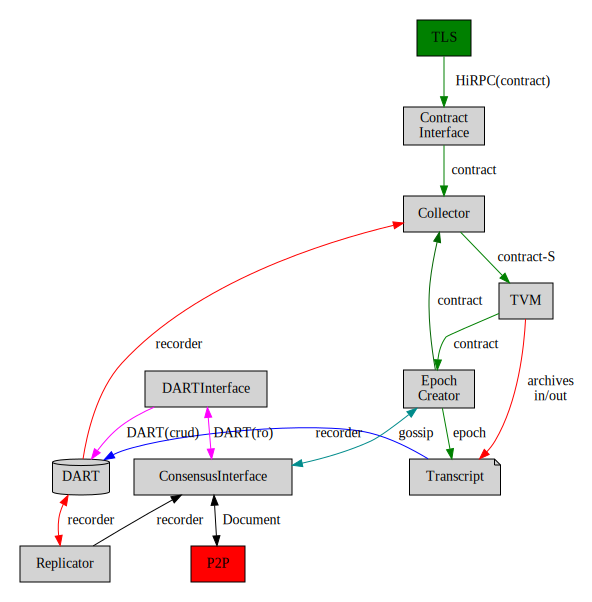

# Tagion Network Architecture

## Description of the services in a node
A node consist of the following services.

* [tagionwave](/src/bin-wave/README.md) is the main task responsible all the service
* [Logger](/documents/architecture/Logger.md) takes care of handling the logger information for all the services.
* [LoggerSubscription]() The logger subscript take care of handling remote logger and event logging.
* [TagionFactory](/documents/architecture/TagionFactory.md) This services takes care of the *mode* in which the network is started.
* [Tagion](/documents/architecture/Tagion.md) is the service which handles the all the services related to the rest of the services (And run the HashGraph).
* [TVM](/documents/architecture/TVM.md) Virtual machine for executing the smart contract functions.
* [DART](/documents/architecture/DART.md) Takes care of the handling data-base instruction and read/write to the physical file system.
* [DARTSync](/documents/architecture/DARTSync.md) Handles the synchronization of the DART to other remote nodes.
* [Recorder](/documents/architecture/Recorder.md) Handles the recorder chain (A Recorder is the write/remove sequency to the DART).
* [Transaction](/documents/architecture/Transaction.md) service handles the format validation of the HiPRC request and HiBON data format.
* [Collector](/documents/architecture/Collector.md) Collector all the input used in the smart-contract.
* [Transcript](/documents/architecture/Transcript.md) Executes transactions in the epoch produced by the HashGraph and generates a Recorder.
* [Consensus](/documents/architecture/Consensus.md) HashGraph consensus services.
* [EpochDump](/documents/architecture/EpochDump.md) Write the Epoch to a file as a backup.
* [Monitor](/documents/architecture/Monitor.md) Monitor interface to display the state of the HashGraph.
* [P2P](/documents/architecture/P2P.md) is used to connect the p2p network.
* [Registration](/documents/architecture/Registration.md) Register for the task and services.

The arrow indicates ownership is means of service-A points to service-B. Service-A has ownership of service-B.

This means that if Service-B fails service-A is responsible to handle and take-care of the action to restart or other action.

## Data Message flow
This graph show the primary data message flow in the network.

## Tagion Service Hierarchy
This graph show the supervisor hierarchy of the services in the network.

